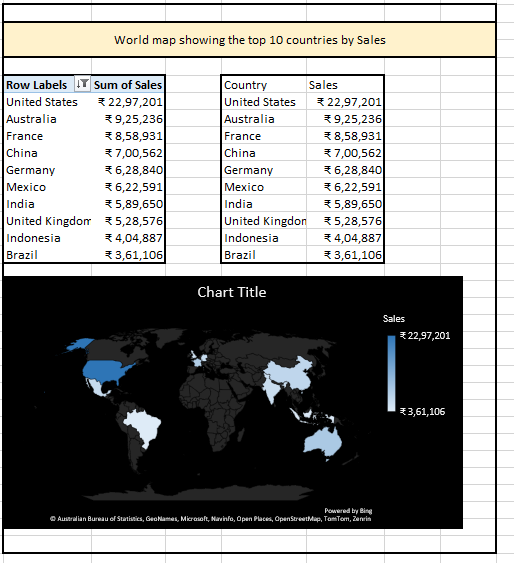
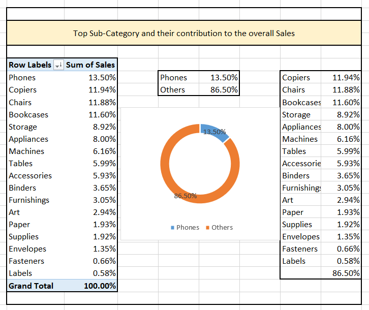
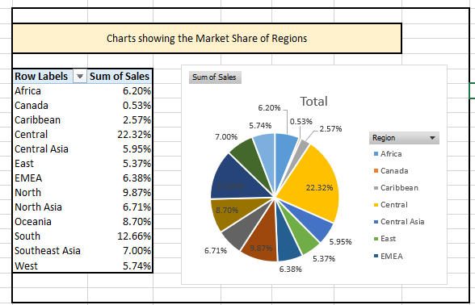
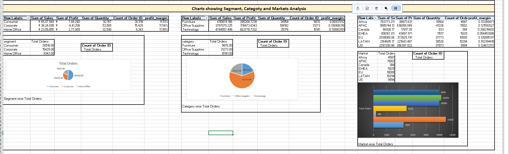
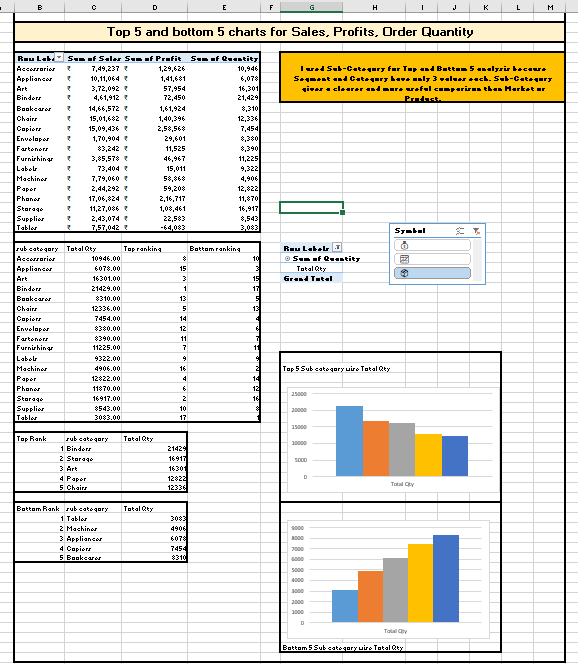
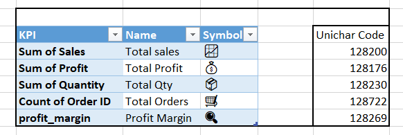
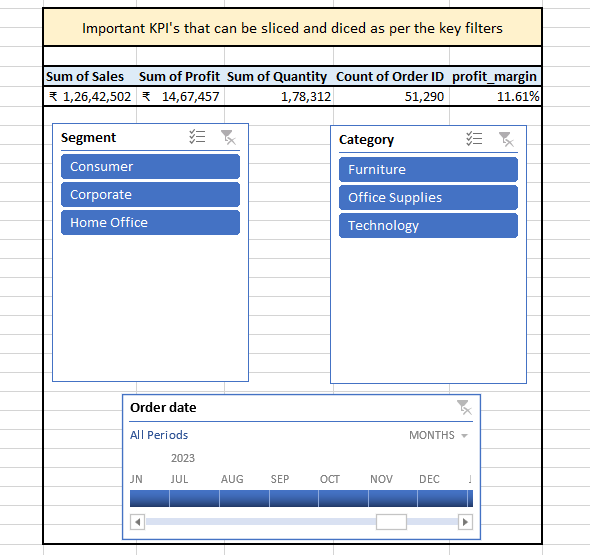
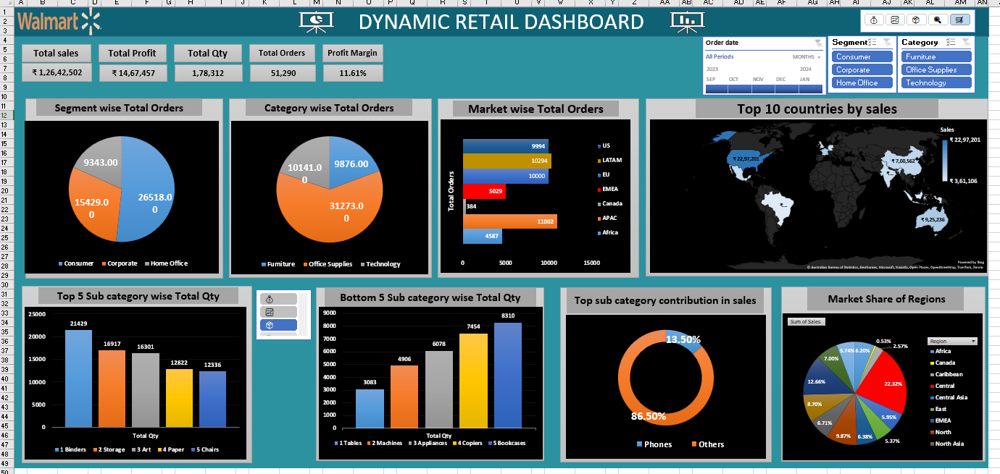

# 🛒 Walmart Dynamic Retail Dashboard (Excel-Based)

This project presents a comprehensive Excel dashboard designed to analyze Walmart’s retail performance across multiple dimensions including geography, product categories, customer segments, and sales KPIs. The dashboard answers key business questions using pivot tables, slicers, charts, and structured data analysis.

---

## 📌 Project Objectives
- Analyze global sales distribution across countries and regions
- Identify top-performing sub-categories and market segments
- Visualize key performance indicators (KPIs) for business decisions
- Enable interactive filtering using slicers for dynamic insights

---

## 🗺️ Top 10 Countries by Sales
A bar chart, data table, and world map highlight Walmart’s top 10 countries by total sales. The United States leads, followed by Australia and France.

---

## 📞 Sub-Category Contribution to Overall Sales
This donut chart and table show how sub-categories like Phones, Copiers, and Chairs contribute to total sales. Phones lead with 13.5% of total revenue.

---

## 🌍 Market Share by Region
A pie chart and table visualize regional market share. Central and Southeast Asia emerge as key contributors to Walmart’s global footprint.

---

## 🧮 Segment & Category Analysis
Pivot tables and pie charts break down sales, profit, and quantity by customer segment (Consumer, Corporate, Home Office) and product category (Furniture, Office Supplies, Technology).

---

## 📊 Top & Bottom Sub-Category Analysis
Bar charts and tables highlight the top 5 and bottom 5 sub-categories based on sales, profit, and quantity. This helps identify high-performing and underperforming areas.

---

## 🧾 KPI Symbols Reference
A reference table showing Unicode symbols used to represent KPIs like Total Sales, Profit, Quantity, Orders, and Profit Margin in the dashboard.

---

## 📋 KPI Dashboard Overview
A snapshot of the dashboard’s top section showing key metrics:
- Total Sales: ₹1,26,42,502  
- Total Profit: ₹14,67,457  
- Total Quantity: 1,78,312  
- Total Orders: 51,290  
- Profit Margin: 11.61%

Interactive slicers allow filtering by Segment, Category, and Order Date.

---

## 🧠 Full Dashboard View
A complete view of the dynamic dashboard, combining all charts, KPIs, and filters into a single interface for strategic decision-making.

---

## 🛠️ Tools & Skills Demonstrated
- **Microsoft Excel**: Pivot Tables, Slicers, Charts, Conditional Formatting  
- **Business Analytics**: KPI tracking, performance segmentation, market analysis  
- **Data Visualization**: Clear, interactive visuals for stakeholder reporting  
- **Dashboard Design**: Structuring insights for usability and clarity

---

## 🎯 Outcome
Delivered a dynamic, section-wise Excel dashboard that answers key business questions and supports data-driven decisions in retail strategy, product planning, and market targeting.
